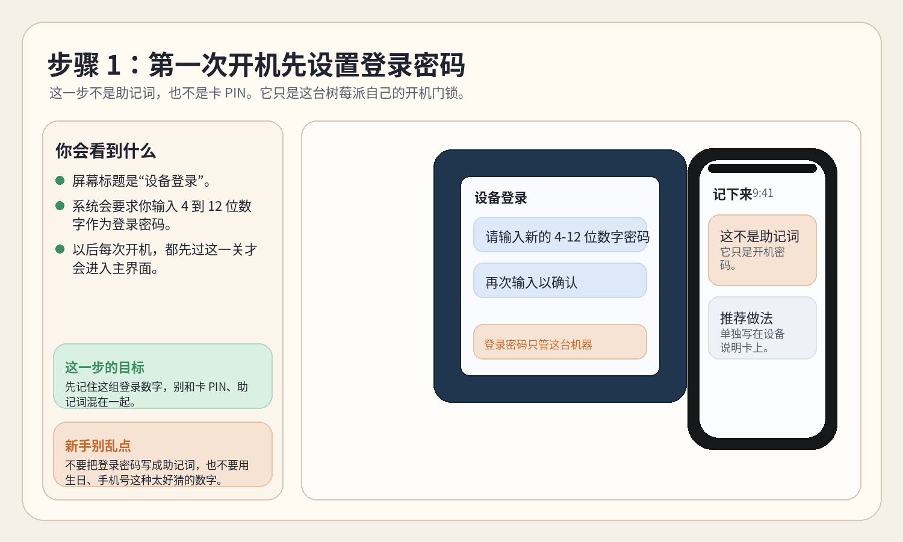
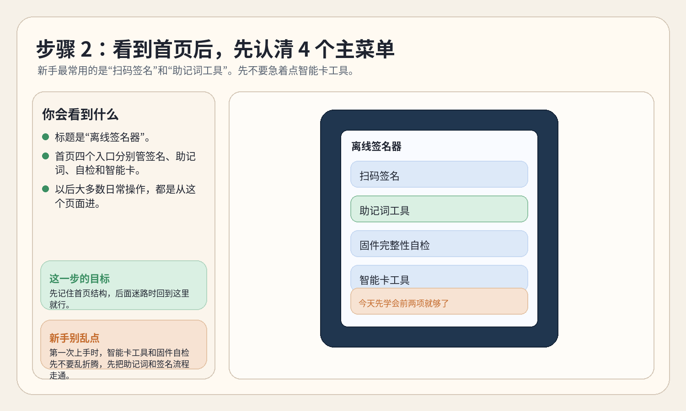
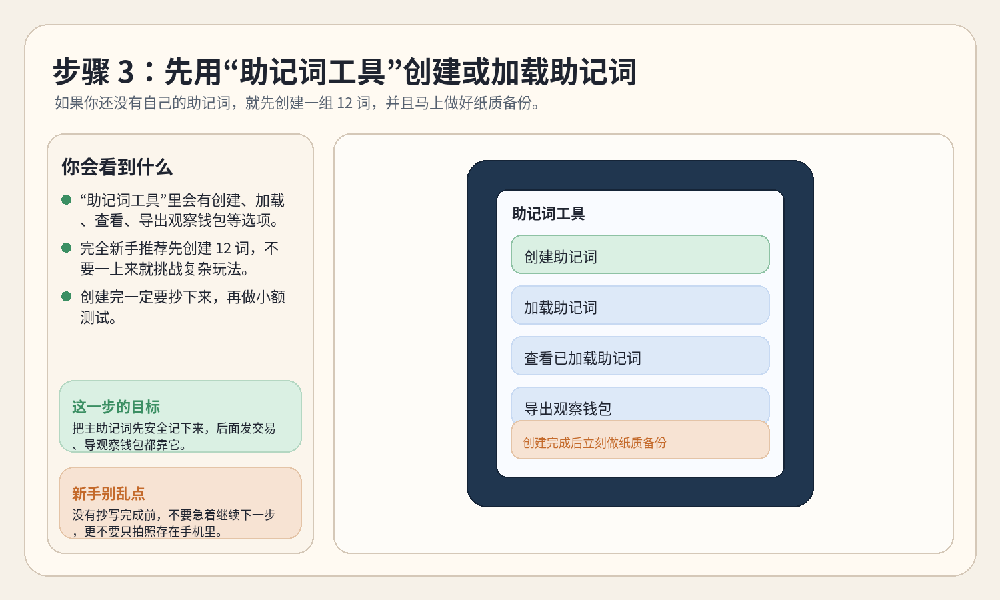
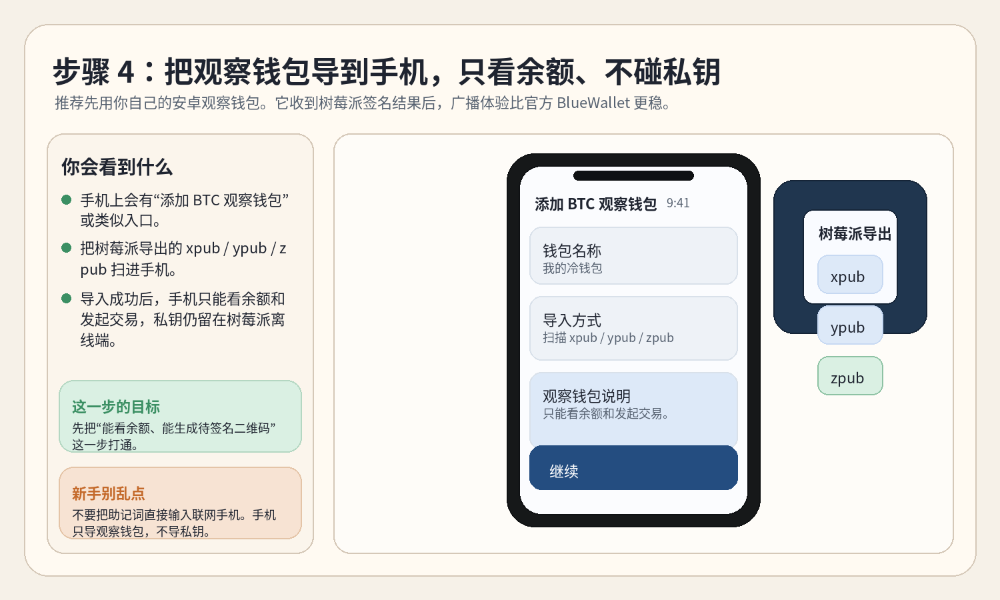
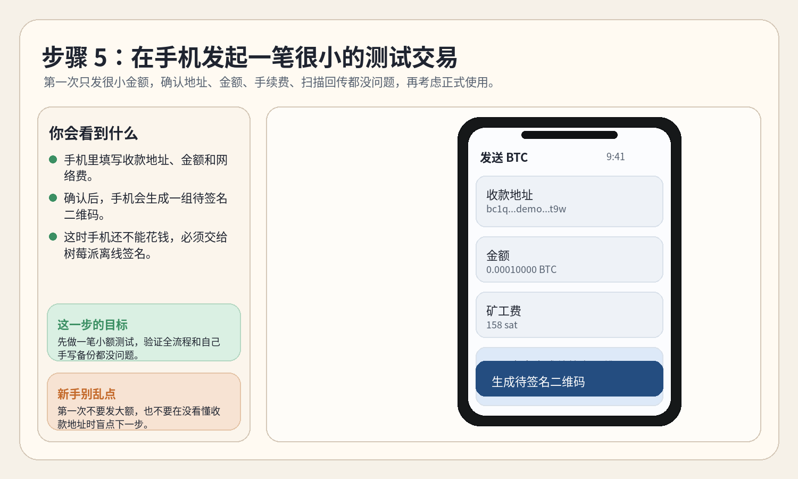
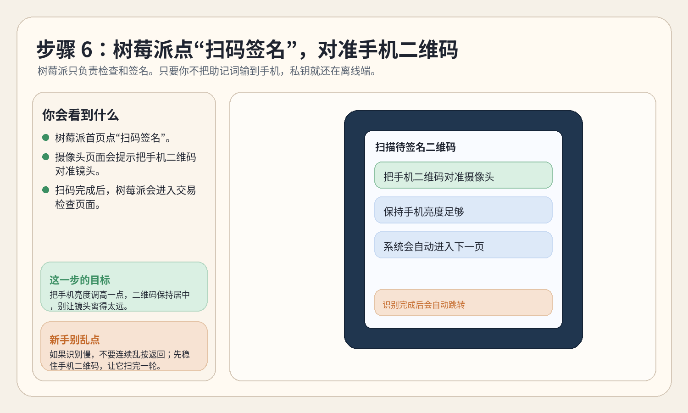
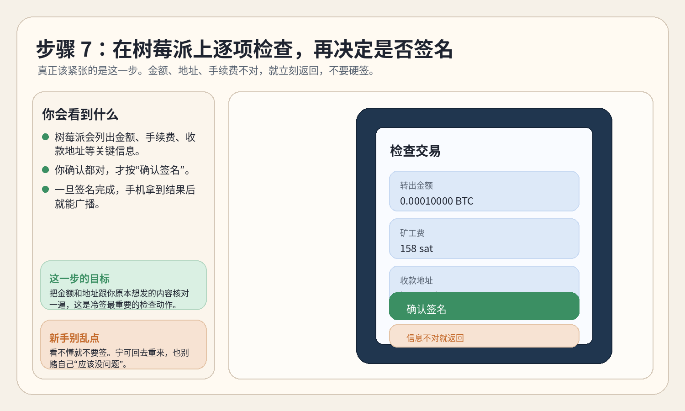
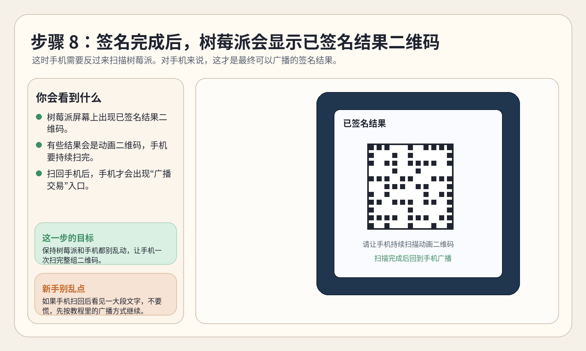
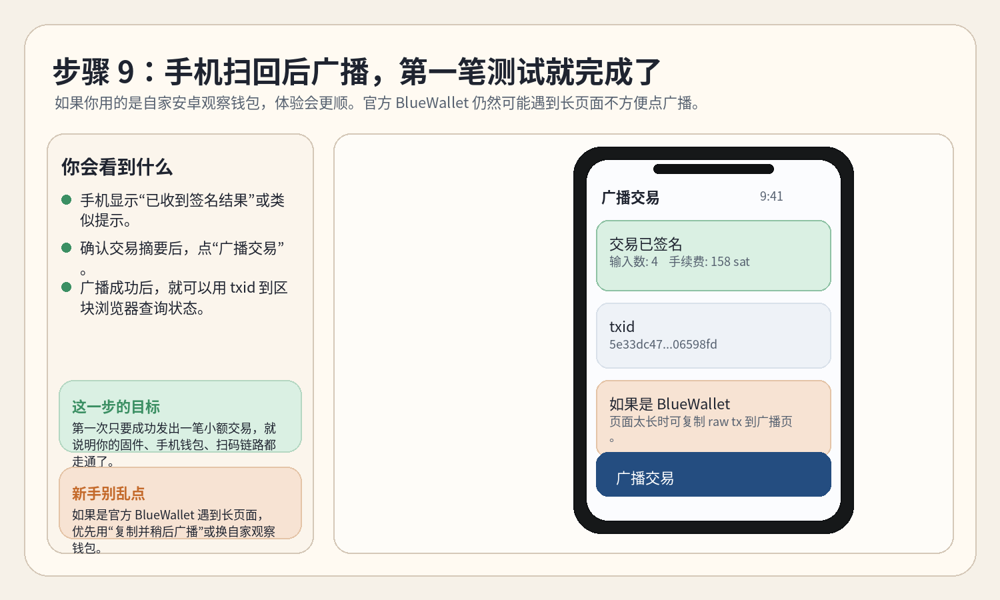
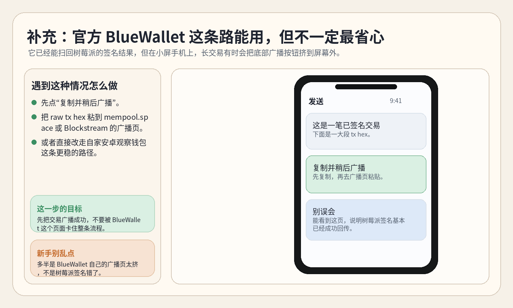

# 逐屏截图版第一次上手教程

这份教程是给完全没接触过这套东西的新手准备的。

如果你已经被一堆名词绕晕了，就先只记一句话：

- 手机负责联网、看余额、发起交易、广播交易
- 树莓派负责离线保存助记词、检查交易、做签名
- 你真正要保护的核心秘密，是助记词和智能卡 PIN

这份教程优先带你走当前最稳、最省心的路线：

- 自家安卓观察钱包
- 树莓派离线签名器
- 第一笔先做小额测试

如果你想先补概念，再回来照图操作，先看：

- [零基础第一次上手教程](零基础第一次上手教程.zh-CN.md)
- [全功能操作总手册](全功能操作总手册.zh-CN.md)
- [第一次小额测试完整流程](第一次小额测试完整流程.zh-CN.md)
- [常见故障一问一答](常见故障一问一答.zh-CN.md)

## 先说明白

下面这些图是当前版本菜单名整理出来的“示意截图”，目的是让你看到页面就知道下一步该点哪里。

- 树莓派和手机的真实字体、图标、边距，可能和图里略有不同
- 但按钮名称、页面顺序、操作思路，按当前仓库文档和发布状态整理
- 以后如果页面文案改了，可以重新运行生成脚本：

```bash
python3 scripts/generate_beginner_screenshot_guide.py
```

## 推荐路线总览

第一次先走这条：

1. 刷好树莓派正式固件
2. 第一次开机设置设备登录密码
3. 进入 `助记词工具`
4. 创建或加载助记词
5. 导出 `BTC xpub / ypub / zpub`
6. 导入到手机观察钱包
7. 手机发起一笔很小的测试交易
8. 树莓派 `扫码签名`
9. 手机扫回签名结果
10. 手机广播交易

## 步骤 1：第一次开机先设置登录密码



这一步只是在给这台树莓派设一个开机门锁。

- 它不是助记词
- 它不是 `Satochip` 或 `SeedKeeper` 的 `PIN`
- 它只是以后每次开机要输入的数字密码

做完以后，你会进入真正的首页。

## 步骤 2：认清首页 4 个主菜单



首页 4 个入口里，新手最常用的只有前两个：

- `扫码签名`
- `助记词工具`

先别被后面两个吓住：

- `固件完整性自检`：后面有空再学
- `智能卡工具`：等你开始用 `Satochip / SeedKeeper` 再碰

## 步骤 3：先在“助记词工具”里创建或加载助记词



如果你还没有自己的主助记词，推荐先创建一组 `12` 词。

这个阶段最重要的不是“赶紧下一步”，而是：

- 把助记词按顺序抄下来
- 自己再核对一遍
- 不要只存在手机截图里

如果你已经有助记词，就走：

- `加载助记词`

如果你是第一次完全从零开始，就走：

- `创建助记词`

## 步骤 4：把观察钱包导到手机



这一页最容易让新手误会，所以再强调一次：

- 手机里导入的是观察钱包
- 观察钱包只负责看余额、发起交易、广播交易
- 真正的助记词仍然只留在树莓派离线端

你在树莓派这边通常会导出：

- `BTC xpub`
- `BTC ypub`
- `BTC zpub`

你在手机这边通常会看到：

- `添加 BTC 观察钱包`
- `扫描 xpub / ypub / zpub`

## 步骤 5：先发起一笔很小的测试交易



第一次一定要先做小额。

这一步在手机里只是“准备交易”：

- 填收款地址
- 填金额
- 选手续费
- 生成待签名二维码

这时钱还没有真正发出去，因为还差树莓派离线签名。

## 步骤 6：树莓派点“扫码签名”，扫手机二维码



操作顺序很简单：

1. 树莓派首页点 `扫码签名`
2. 手机保持二维码亮着
3. 树莓派摄像头对准手机
4. 等它自己进入下一页

如果识别慢：

- 先把手机亮度调高
- 二维码尽量放正
- 不要疯狂按返回

## 步骤 7：树莓派逐项检查交易，再确认签名



这是全流程里最关键的一步。

你要检查：

- 金额是不是你想发的那个金额
- 手续费是不是你能接受的水平
- 收款地址是不是你要发去的地址

看不懂就不要签。

宁可返回重来，也不要因为赶时间直接硬按确认。

## 步骤 8：签名完成后，手机反过来扫树莓派



这一步和刚才相反：

- 刚才是树莓派扫手机
- 现在是手机扫树莓派

有些签名结果会是动画二维码。

所以要注意：

- 手机别只扫一瞬间
- 让它持续扫完整组二维码
- 中途不要随便切页面

## 步骤 9：手机广播交易



手机成功收到签名结果后，才会出现广播入口。

这一步成功以后，你就已经完成了第一笔完整测试：

- 手机发起
- 树莓派离线签名
- 手机扫回
- 手机广播

广播成功后，可以用 `txid` 去区块浏览器查状态。

## 补充：如果你走的是官方 BlueWallet



官方 `BlueWallet` 现在已经能扫回树莓派的签名结果。

但在小屏手机上，长交易有时会遇到这个情况：

- 页面里出现一大段十六进制文本
- 底部 `Broadcast` 按钮不容易点到

这时别以为是树莓派签坏了。

通常更像是 `BlueWallet` 自己的广播页 UI 问题。你可以这样继续：

1. 点 `复制并稍后广播`
2. 把 `raw tx hex` 粘到别的广播页
3. 或者直接改走自家安卓观察钱包

常用广播页：

- <https://mempool.space/tx/push>
- <https://blockstream.info/tx/push>

## 最后的新手提醒

第一次真正上手时，只要记住 4 条：

1. 助记词永远不要直接输到联网手机
2. 第一次先做小额测试
3. 树莓派上检查不懂就不要签
4. 一条流程走通后，再去学 `BIP85`、钛板备份、智能卡工具这些进阶玩法

如果你接下来还要继续看：

- [零基础第一次上手教程](零基础第一次上手教程.zh-CN.md)
- [全功能操作总手册](全功能操作总手册.zh-CN.md)
- [第一次小额测试完整流程](第一次小额测试完整流程.zh-CN.md)
- [树莓派菜单逐项说明](树莓派菜单逐项说明.zh-CN.md)
- [常见故障一问一答](常见故障一问一答.zh-CN.md)
- [三条常用流程速查卡](三条常用流程速查卡.zh-CN.md)
