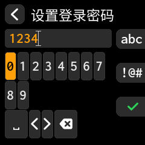
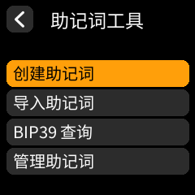
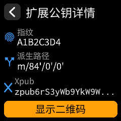
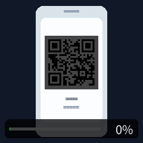
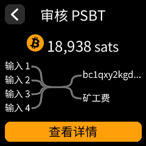
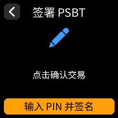

# 逐屏真实 UI 截图版第一次上手教程

这份教程是给完全没接触过加密货币、也没碰过这套设备的新手准备的。

先说明白这份图文到底是什么：

- 这不是手绘示意图
- 也不是拿手机对着设备随便拍的照片
- 这份里的树莓派页面，都是直接用当前固件自己的 UI 代码在电脑里渲染出来的真实界面截图

这意味着两件事：

- 你现在看到的菜单样式、按钮位置、页面标题，和当前固件真正显示的会非常接近
- 以后只要界面改版，还可以直接重新生成，不用再靠人手慢慢重画

当前截图素材来自：

- [scripts/generate_real_ui_screenshots.py](../scripts/generate_real_ui_screenshots.py)
- [docs/assets/real-ui-screenshot-guide](assets/real-ui-screenshot-guide)

如果你以后要重生成这套图，直接跑：

```bash
bash scripts/setup_desktop_smoke_env.sh /tmp/satochip-desktop-smoke-venv
python3 scripts/generate_real_ui_screenshots.py /tmp/satochip-desktop-smoke-venv
```

如果你现在只想先走通第一笔小额测试，就按下面这条最稳路线来：

1. 刷好树莓派正式固件
2. 第一次开机先设置登录密码
3. 在 `助记词工具` 里创建或导入助记词
4. 导出 `BTC xpub / ypub / zpub`
5. 导入到手机观察钱包
6. 手机发起一笔很小的测试交易
7. 树莓派 `扫码签名`
8. 检查交易内容
9. 输入智能卡 `PIN` 完成签名
10. 手机扫回签名结果并广播

如果你想先补概念，再回来照图操作，先看：

- [零基础第一次上手教程](零基础第一次上手教程.zh-CN.md)
- [全功能操作总手册](全功能操作总手册.zh-CN.md)
- [第一次小额测试完整流程](第一次小额测试完整流程.zh-CN.md)
- [常见故障一问一答](常见故障一问一答.zh-CN.md)

## 步骤 1：第一次开机先设置登录密码



这里设置的是这台树莓派自己的开机门锁。

一定分清楚：

- 它不是助记词
- 它不是 `Satochip` 或 `SeedKeeper` 的 `PIN`
- 它只是以后每次开机先输入的数字登录密码

建议：

- 用 `4-12` 位数字
- 自己能记住
- 不要和智能卡 `PIN` 设成完全一样

## 步骤 2：登录后先认清首页 4 个入口


新手最常用的通常只有前两个：

- `扫码签名`
- `助记词工具`

另外两个先知道是干什么就够了：

- `固件完整性自检`
- `智能卡工具`

第一次上手，先别一上来就把所有菜单都点一遍。先把一条完整小额测试流程走通最重要。

## 步骤 3：进入“助记词工具”



如果你还没有自己的主助记词，推荐先在这里创建。

如果你已经有旧助记词，要走：

- `导入助记词`

如果你是从零开始，常见起步方式有：

- `智能卡真随机创建助记词`
- `摇骰子创建助记词`
- `使用扑克牌创建助记词`
- `使用16进制创建助记词`

这个阶段最重要的不是赶紧发币，而是：

- 把助记词按顺序抄好
- 自己再核对一遍
- 不要只存在联网手机里

## 步骤 4：导出 BTC 观察钱包信息



这一步是把“观察钱包信息”给手机，不是把真正助记词给手机。

你要记住：

- 手机里导入的是观察钱包
- 观察钱包负责看余额、发起交易、广播交易
- 真正能花钱的助记词和私钥材料，仍然只留在树莓派离线端和智能卡里

常见会导出的内容包括：

- `BTC xpub`
- `BTC ypub`
- `BTC zpub`

如果你主要配合 `BlueWallet`，通常更常见的是：

- `zpub`
- `xpub`

## 步骤 5：在手机里导入观察钱包并发起一笔小额测试

这一步在手机里完成，所以这里我直接把最短操作写清楚：

1. 打开你的观察钱包
2. 选择添加 `BTC` 观察钱包
3. 扫树莓派导出的 `xpub / ypub / zpub`
4. 确认余额和地址能正常显示
5. 发起一笔非常小的测试交易
6. 生成待签名二维码

第一次一定要小额。

因为这一步做错了，后面即使签名流程走通，也只是把错误交易签出去了。

## 步骤 6：树莓派点“扫码签名”，扫手机待签名二维码



操作顺序很简单：

1. 树莓派首页点 `扫码签名`
2. 手机把待签名二维码保持亮着
3. 树莓派摄像头对准手机
4. 等它自动进入交易检查页面

如果识别慢：

- 先把手机亮度调高
- 二维码尽量放正
- 不要来回疯狂按返回

## 步骤 7：先检查交易，再决定要不要签



这一步非常关键。

你至少要看 3 件事：

- 金额是不是你想发的金额
- 矿工费是不是你能接受
- 收款地址是不是你要发去的那个地址

看不懂就先别签。

宁可返回重来，也不要因为赶时间直接确认。

## 步骤 8：确认无误后，输入智能卡 PIN 完成签名



到这一步，说明树莓派已经把交易内容读进来了。

接下来通常要做的是：

1. 插好卡或贴好卡
2. 输入智能卡 `PIN`
3. 等树莓派完成签名

如果这里失败，常见原因通常是：

- 智能卡 `PIN` 输入错误
- 卡没贴稳或读卡器没接好
- 手机那边给来的二维码没扫完整

## 步骤 9：树莓派会显示签名结果二维码


这一步和刚才相反：

- 刚才是树莓派扫手机
- 现在是手机扫树莓派

有些格式是单张二维码，有些是动画二维码。

所以要注意：

- 手机别只扫一瞬间
- 要让它持续扫完整组二维码
- 中途不要随便切页面

## 步骤 10：手机扫回结果并广播

手机成功收齐已签名结果后，才会出现广播入口。

这时你就完成了一笔完整闭环：

- 手机发起交易
- 树莓派离线检查和签名
- 手机扫回结果
- 手机广播到网络

广播成功后，可以用 `txid` 去区块浏览器查状态。

常用广播页：

- <https://mempool.space/tx/push>
- <https://blockstream.info/tx/push>

## 补充：如果你走的是官方 BlueWallet

官方 `BlueWallet` 现在已经能扫回树莓派的签名结果。

但小屏手机有时会遇到这个情况：

- 页面里出现一大段十六进制文本
- 底部 `Broadcast` 按钮不容易点到

这通常更像是 `BlueWallet` 自己的广播页排版问题，不是树莓派签坏了。

这时可以这样继续：

1. 点 `复制并稍后广播`
2. 把 `raw tx hex` 粘到别的广播页
3. 或者改走自家安卓观察钱包

## 最后的新手提醒

第一次真正上手时，只要记住 4 条：

1. 助记词永远不要直接输到联网手机
2. 第一次先做小额测试
3. 树莓派上看不懂就不要签
4. 一条完整流程走通后，再去学 `BIP85`、钛板备份、智能卡工具这些进阶玩法

如果你接下来还要继续看：

- [零基础第一次上手教程](零基础第一次上手教程.zh-CN.md)
- [全功能操作总手册](全功能操作总手册.zh-CN.md)
- [第一次小额测试完整流程](第一次小额测试完整流程.zh-CN.md)
- [树莓派菜单逐项说明](树莓派菜单逐项说明.zh-CN.md)
- [常见故障一问一答](常见故障一问一答.zh-CN.md)
- [三条常用流程速查卡](三条常用流程速查卡.zh-CN.md)
- [真机实拍逐屏截图采集清单](真机实拍逐屏截图采集清单.zh-CN.md)
